# Diploma
The main purpose of diploma is to develop Neural Network approach for face segmentation in real time on Android device. Here is the list of assumptions and limitations:
1. Model should be able to work with deiiferent face classes like skin, eyes, beard and ect.
2. Metrics should be good enough for visual interpretation quality of the model
3. Model should work in real time (30 FPS or inference time less then 35 ms) at least on desktop CPU
4. Model shouldn't be robust to all possible situations like bad image quality, lighting, strange rotations and ect.
5. Android application have work but haven't be perefectly designed according to UI and UX

## Beauty example
Cause of low image quality, beauty examples looks not perfect and can be founded [here](https://github.com/MaksimKrug/Diploma/blob/main/src/Beauty%20example.ipynb)

## Data
### [Face/Head Segmentation Dataset Community Edition](https://store.mut1ny.com/product/face-head-segmentation-dataset-community-edition?v=f9308c5d0596)
Free community edition of the face/head segmentation dataset that is licensed under creative common non-commercial license and can be used by everybody freely for research and educational purposes.

This version of the dataset contains over 16.5k (16557) fully pixel-level labeled segmentation images. Facial images are included from different ethnicity, ages and genders making it a well balanced dataset. Also there is a wide variety of facial poses and different camera angles. Some images even contain multiple head/face segmentation depending on if the second or third face takes up enough screen real estate space.

For each real image there exist a PNG RGB label image pair. It encodies the 11 different labeled areas of the face using the following RGB labels:
1. Background
2. Lips/mouth
3. Eyes
4. Nose
5. General face/head
6. Hair
7. Eyebrows
8. Ears
9. Teeth
10. Facial hair/beard
11. Specs/sunglasses

### [CelebAMask-HQ](https://github.com/switchablenorms/CelebAMask-HQ)
CelebAMask-HQ is a large-scale face image dataset that has 30,000 high-resolution face images selected from the CelebA dataset by following CelebA-HQ. Each image has segmentation mask of facial attributes corresponding to CelebA.

The masks of CelebAMask-HQ were manually-annotated with the size of 512 x 512 and 19 classes including all facial components and accessories such as skin, nose, eyes, eyebrows, ears, mouth, lip, hair, hat, eyeglass, earring, necklace, neck, and cloth.

Preprocessing:
1) Because we don't have a beard class in this dataset all images with beard was deleted (higher then 0.01 from image size theshold)
2) Labels was matched with previous dataset:
    1. Background: _cloth, _hat, _neck_l, _ear_r
    2. Lips: _l_lip, _u_lip,
    3. Eye: _l_eye, _r_eye,
    4. Nose: _nose,
    5. Hair: _hair,
    6. Eyebrows: _l_brow, _r_brow,
    7. Teeth: _mouth,
    8. Face: _neck, _skin,
    9. Ears: _r_ear, _l_ear,
    10. Glasses: _eye_g,
    11. Beard: None,

## Baseline & Experiments with weights, optimizers and loss functions
For baselines I used different encoders, optimizers and losses. For models training I used features:
1. Epochs = 20
2. Batch Size = 8
3. Architecture = U-Net
4. Scheduler = LRScheduler(patience=2, factor=0.1)
5. Earlystopping(monitor=val_f1, patience=3)
6. GPU = RTX 3060
7. CPU = Intel Core i5-11400F
8. Metrics = F1 and IoU macro
9. Data = sample 20000 of two datasets

Baseline model metrics presented bellow. Model work not bad. Inference time enough for 30 FPS. But for mobile devices model will work much slower (about 5 times).
| Model | Backbone              | Loss        | Optimizer   | Model Parameters | Modules | IoU   | F1    | Inference Time (GPU), ms | Inference Time (CPU), ms|
| ----- | --------              | ----        | ---------   | ---------------- | ------- | ---   | --    | ------------------       | ----------------------- |
| unet  | mobilenetv3_small_100 | BCEWeighted | Adam        | 3.6              | 237     | 0.783 | 0.876 | 6.154                    | 24.559                  |

### [U-Net](https://arxiv.org/pdf/1505.04597.pdf)
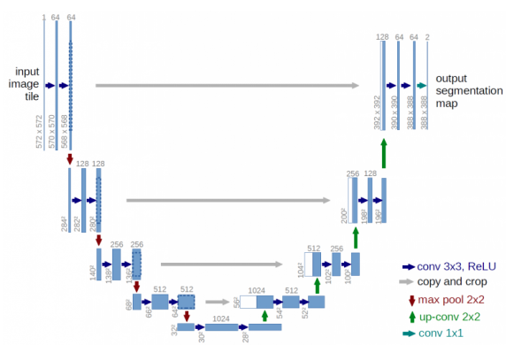

<b> Fig. U-Net architecture </b>

U-Net is a widely used architecture for image segmentation. In my work, I used U-Net as a baseline. I changed basic architecture and used different encoders, like Xception, EfficientNet and ect.

### [Xception](https://arxiv.org/pdf/1610.02357.pdf)
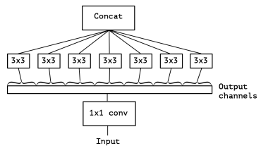

<b> Fig. Separable convolution </b>

<b> From abstract: </b> Xception is an interpretation of Inception modules in convolutional neural networks as being an intermediate step in-between regular convolution and the depthwise separable convolution operation (a depthwise convolution followed by a pointwise convolution). In this light, a depthwise separable convolution can be understood as an Inception module with a maximally large number of towers.  
This observation leads authors to propose a novel deep convolutional neural network architecture inspired by Inception, where Inception modules have been replaced with depthwise separable convolutions.

The Xception architecture is based on the assumption that information about spatial and channel dimensions can be calculated sequentially without loss of network performance, and decompose the usual convolution into pointwise convolution (determining only inter-channel correlation) and spatial convolution (determining only spatial correlation within a separate context).

Separable convolution block include two operations:
1. Pointwise convolution - a convolution operation with 1x1 kernel.
2. Depthwise spatial convolution - apply aconvolution with 3x3 kernel to each channel separately.

### Weights
Model was tested with different weights for classes. Order of classes is [background, lips, eye, nose, hair, eyebrows, teeth, face, ears, glasses, beard]. Weights types:

1. Equals - all weights equal to 1
2. Empirical - [0.5, 3, 3, 1, 0.5, 3, 2, 0.5, 1.5, 1.5, 1.5]
3. Proportional - [0.0403, 1.8895, 4.3349, 0.9494, 0.0718, 2.6287, 7.0844, 0.0643, 1.7070, 5.7402, 3.7832]

The best results we have when train model with proportional weights. We have highly unbalanced classes distribution and it's normal to have such results.

| Weights      | Backbone              | Loss        | Optimizer | Model Parameters | Modules | IoU   | F1    | Inference Time (GPU), ms | Inference Time (CPU), ms |
| -----        | --------              | ----        | --------- | ---------------- | ------- | ---   | --    | ------------------       | ------------------------ |
| equals       | mobilenetv3_small_100 | BCEWeighted | Adam      | 3.6              | 237     | 0.783 | 0.876 | 6.154                    | 24.559                   |
| empirical    | mobilenetv3_small_100 | BCEWeighted | Adam      | 3.6              | 237     | 0.802 | 0.888 | 6.137                    | 24.415                   |
| proportional | mobilenetv3_small_100 | BCEWeighted | Adam      | 3.6              | 237     | 0.803 | 0.889 | 6.203                    | 24.108                   |

### Backbones
I tested different encoders for U-Net architecture and compare the results with MobilenetV3 small. For this and further tests I used proportional weights.

Xception and EfiicientNet backbones works better than MobileNetV3_small, but Inference time far from threshold. I decided continue experiment with MobileNetV3_small.

| Backbone              | Loss        | Optimizer | Model Parameters | Modules | IoU   | F1    | Inference Time (GPU), ms | Inference Time (CPU), ms |
| --------              | ----        | --------- | ---------------- | ------- | ---   | --    | ------------------       | ------------------------ |
| xception              | BCEWeighted | Adam      | 28.28            | 278     | 0.825 | 0.903 | 6.136                    | 88.623                   |
| efficientnet-b3       | BCEWeighted | Adam      | 13.2             | 455     | 0.820 | 0.900 | 13.738                   | 67.822                   |
| mobilenetv3_large_100 | BCEWeighted | Adam      | 6.7              | 274     | 0.811 | 0.894 | 7.168                    | 36.052                   |

#### [EfficientNet-B3](https://arxiv.org/pdf/1905.11946.pdf)

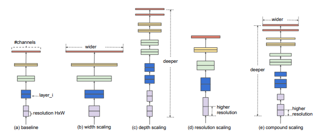

<b> Fig. EfficientNet model scaling </b>

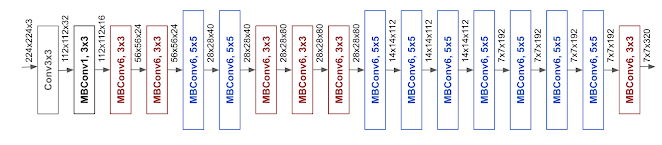

<b> Fig. EfficientNet-B0 architecture </b>

<b> From abstract: </b> Article's authors systematically study model scaling and identify that carefully balancing network depth, width, and resolution can lead to better performance. Based on this observation, they propose a new scaling method that uniformly scales all dimensions of depth/width/resolution using a simple yet highly effective compound coefficient.
To go even further, they use neural architecture search to design a new baseline network and scale it up to obtain a family of models, called EfficientNets, which achieve much better accuracy and efficiency than previous ConvNets. The difference between B0 and B7 architecture is number of convolutions and others blocks, but number of layers are the same.

#### [MobileNetV3](https://arxiv.org/pdf/1905.02244.pdf)

<b> Fig. [MobileNetV1](https://arxiv.org/pdf/1704.04861.pdf): depthwise convolution </b>

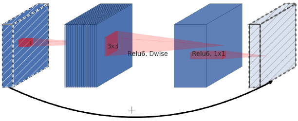

<b> Fig. [MobileNetV2](https://arxiv.org/pdf/1801.04381.pdf): inverted residual </b>

<b> From abstract: </b> MobileNetV3 based on a combination of complementary search techniques as well as a novel architecture design. MobileNetV3 is tuned to mobile phone CPUs through a combination of hardwareaware network architecture search (NAS) complemented by the NetAdapt algorithm and then subsequently improved through novel architecture advances. This paper starts the exploration of how automated search algorithms and network design can work together to harness complementary approaches improving the overall state of the art. Through this process authors create two new MobileNet models for release: MobileNetV3-Large and MobileNetV3-Small which are targeted for high and low resource use cases. These models are then adapted and applied to the tasks of object detection and semantic segmentation. For the task of semantic segmentation (or any dense pixel prediction), authors propose a new efficient segmentation decoder Lite Reduced Atrous Spatial Pyramid Pooling (LR-ASPP). 

### Optimizers

| Backbone              | Loss        | Optimizer | Model Parameters | Modules | IoU   | F1    | Inference Time (GPU), ms | Inference Time (CPU), ms |
| --------              | ----        | --------- | ---------------- | ------- | ---   | --    | ------------------       | ------------------------ |
| mobilenetv3_small_100 | BCEWeighted | AdamP     | 3.6              | 237     | 0.773 | 0.870 | 6.257                    | 24.841                   |
| mobilenetv3_small_100 | BCEWeighted | AdaBelief | 3.6              | 237     | 0.727 | 0.840 | 6.415                    | 25.009                   |

#### [Adam](https://arxiv.org/pdf/1412.6980.pdf)

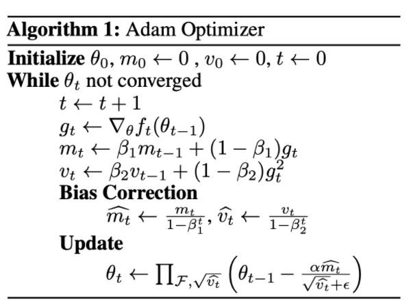

<b> Fig. Adam algorithm </b>

Notations used here:

1. f(θ): f is the loss function to be optimized given the parameter(weights) θ.
2. g-t: g is the gradient at step t.
3. m-t: m is the exponential moving average(EMA) of g-t.
4. v-t: v is the exponential moving average(EMA) of (g-t)².
5. β1, β2: These are the hyperparameters used in the moving averages of g-t and (g-t)², most commonly set to 0.9 and 0.999 respectively.
6. α: The learning rate.
7. ε: A very small number, used to avoid the denominator = 0 scenario.

To make this descent faster, we combine two optimization techniques:

We compute the EMA of the gradient m-t and use it in the numerator of the update direction. So if m-t has a high value, that means the descent is headed in the right direction so we take bigger steps. Similarly, if the the value of m-t is low, it means the descent is probably not heading towards the minimum and we take smaller steps. This is the momentum part of the optimizer.

We compute the EMA of the gradient squared v-t and use it in the denominator of the update direction. Since we are taking the square of the gradients here, suppose if same sized gradient updates are taking place in the opposite directions alternately, m-t would have a value close to 0 as the positive and negative values would cancel out when summed. But v-t will have a high value in this case. And since here we are not heading towards the minima, we don’t want to take steps in this direction. Hence, we keep v-t in the denominator of the update direction as on dividing by a high value the update steps will get smaller, and similarly when v-t has a low value the steps will get bigger. This is the RMSProp part of the optimizer.

#### [AdamP](https://arxiv.org/pdf/2006.08217.pdf)

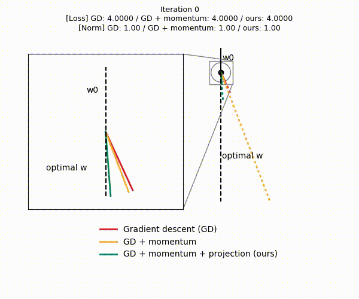

<b> Fig. AdamP convergences on a toy example </b>

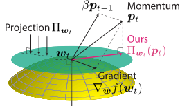

<b> Fig. Vector directions of the gradient, momentum, and ours </b>

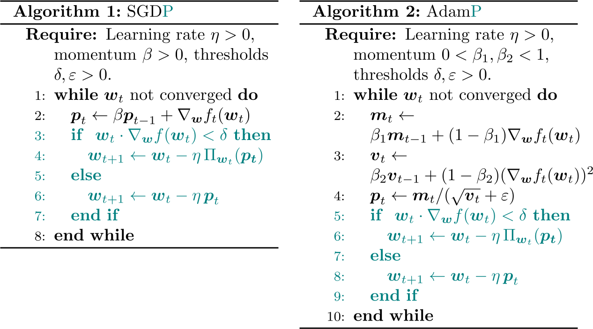

<b> Fig. AdamP algorithm for SGDP and AdamP</b>

<b> From article </b>: widely-used normalization techniques in deep networks result in the scale invariance for weights. Introduction of momentum in gradient-descent (GD) optimizers, when applied on such scale-invariant parameters, decreases the effective learning rate much more rapidly. We suspect the resulting early convergence may have introduced sub-optimality in many SGD and Adam-trained models across machine learning tasks.

#### [AdaBelief](https://arxiv.org/pdf/2010.07468.pdf)

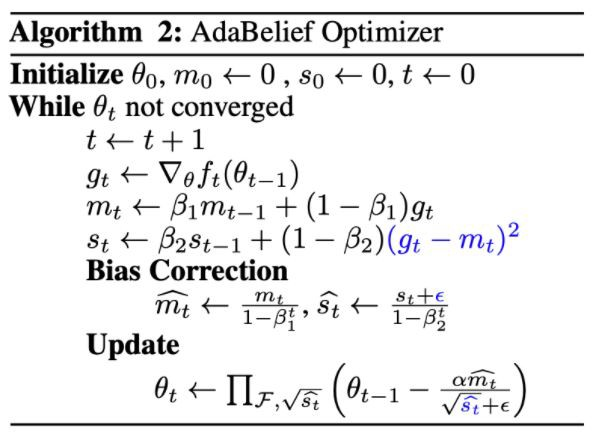

<b> Fig. AdaBelief algorithm </b>

s-t is defined as the EMA of (g-t - m-t)², that is, the square of the difference between the gradient and the EMA of the gradient(m-t). This means that AdaBelief takes a large step when the value of the gradient is close to its EMA, and a small step when the two values are different.

### Losses
For all losses I used weighted version (calculate loss and multiply on weights). Loss calculated separately for all classes. As a result we are using mean value of loss for each class.

Focal and Bias losses works good. For further tests I also used one of them to compare results for different architectures.

| Backbone              | Loss        | Optimizer | Model Parameters | Modules | IoU   | F1    | Inference Time (GPU), ms | Inference Time (CPU), ms |
| --------              | ----        | --------- | ---------------- | ------- | ---   | --    | ------------------       | ------------------------ |
| mobilenetv3_small_100 | DiceLoss    | Adam      | 3.6              | 236     | 0.642 | 0.718 | 6.526                    | 25.331                   |
| mobilenetv3_small_100 | FocalLoss   | Adam      | 3.6              | 236     | 0.807 | 0.892 | 6.448                    | 25.272                   |
| mobilenetv3_small_100 | TverskyLoss | Adam      | 3.6              | 236     | 0.635 | 0.714 | 6.350                    | 25.237                   |
| mobilenetv3_small_100 | BiasLoss    | Adam      | 3.6              | 238     | 0.802 | 0.889 | 6.410                    | 25.123                   |

#### BCEWeighted
Widely used with skewed datasets. Weights positive examples with coefficients.

#### [DiceLoss](https://arxiv.org/pdf/1707.03237.pdf)
Inspired from Dice Coefficient, a metric to evaluate segmentation results. As Dice Coefficient is non-convex in nature, it has been modified to make it more tractable.

#### [FocalLoss](https://arxiv.org/pdf/1708.02002.pdf)
Works best with highly imbalanced dataset. Down weight the contribution of easy examples, enabling model to learn hard examples.

#### [TverskyLoss](https://arxiv.org/pdf/1706.05721.pdf)
Variant of Dice Coefficient. Add weight to False positive and False negative.

#### [BiasLoss](https://arxiv.org/pdf/2107.11170.pdf)
Bias Loss focuses the training on a set of valuable data points and prevents the vast number of samples with poor learning features from misleading the optimization process.

## [DDRNET-23-slim](https://arxiv.org/pdf/2101.06085v2.pdf)

| Model          | Weights      | Loss        | Optimizer | Model Parameters | Modules | IoU   | F1    | Inference Time (GPU), ms | Inference Time (CPU), ms |
| --------       | ----         | ------      |---------  | ---------------- | ------- | ---   | --    | ------------------       | ------------------------ |
| ddrnet_23_slim | equal        | BCEWeighted | Adam      | 5.7              | 192     | 0.749 | 0.853 | 6.110                    | 14.044                   |
| ddrnet_23_slim | proportional | BCEWeighted | Adam      | 5.7              | 192     | 0.773 | 0.870 | 6.009                    | 13.768                   |
| ddrnet_23_slim | proportional | FocalLoss   | Adam      | 5.7              | 192     | 0.774 | 0.870 | 5.907                    | 13.778                   |

model	loss	optimizer	model_parameters	modules	IoU	F1	Inference Time (GPU), ms	Inference Time (CPU), ms
0	ddrnet_23_slim	BCEWeighted	Adam	5.7	192	0.749821	0.853107	6.110778	14.044445
1	ddrnet_23_slim	BCEWeighted	Adam	5.7	192	0.773878	0.870396	6.009048	13.768001
2	ddrnet_23_slim	FocalLoss	Adam	5.7	191	0.774490	0.870585	5.907646	13.778235

| Model     | Weights      | Loss        | Optimizer | Model Parameters | Modules | IoU   | F1    | Inference Time (GPU), ms | Inference Time (CPU), ms |
| --------  | ----         | ----------- | --------- | ---------------- | ------- | ---   | --    | ------------------       | ------------------------ |
| ddrnet_23 | equal        | BCEWeighted | Adam      | 20.1             | 192     | 0.782 | 0.875 | 5.716                    | 33.661                   |
| ddrnet_23 | proportional | BCEWeighted | Adam      | 20.1             | 192     | 0.795 | 0.884 | 6.277                    | 34.035                   |
| ddrnet_23 | proportional | FocalLoss   | AdamP     | 20.1             | 192     | 0.796 | 0.884 | 6.201                    | 35.923                   |

<b> From abstract: </b> Using light-weight architectures (encoder-decoder or two-pathway) or reasoning on low-resolution images, recent methods realize very fast scene parsing, even running at more than 100 FPS on a single 1080Ti GPU. However, there is still a significant gap in performance between these real-time methods and the models based on dilation backbones. To tackle this problem, we proposed a family of efficient backbones specially designed for real-time semantic segmentation. The proposed deep dual-resolution networks (DDRNets) are composed of two deep branches between which multiple bilateral fusions are performed. Additionally, we design a new contextual information extractor named Deep Aggregation Pyramid Pooling Module (DAPPM) to enlarge effective receptive fields and fuse multi-scale context based on low-resolution feature maps.

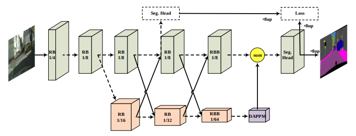

<b> Fig. DDRNet architecture </b>

## [RegSeg](https://arxiv.org/pdf/2111.09957.pdf)

<b> From abstract: </b> Recent advances in semantic segmentation generally adapt an ImageNet pretrained backbone with a special context module after it to quickly increase the field-of-view. Although successful, the backbone, in which most of the computation lies, does not have a large enough field-of-view to make the best decisions. Some recent advances tackle this problem by rapidly downsampling the resolution in the backbone while also having one or more parallel branches with higher resolutions. We take a different approach by designing a ResNeXt inspired block structure that uses two parallel 3 × 3 convolutional layers with different dilation rates to increase the field-of-view while also preserving the local details. By repeating this block structure in the backbone, we do not need to append any special context module after it.

<b> Fig. RegSeg Y block and D block </b>

| Model     | Weights      | Loss        | Optimizer | Model Parameters  | Modules | IoU   | F1    | Inference Time (GPU), ms | Inference Time (CPU), ms |
| --------  | ----         | ----        |---------  | ----------------  | ------- | ---   | --    | ------------------       | ------------------------ |
| regseg    | equal        | BCEWeighted | Adam      | 3.7               | 371     | 0.809 | 0.889 | 10.098                   | 26.243                   |
| regseg    | equal        | BCEWeighted | Adam      | 3.7               | 371     | 0.829 | 0.905 | 10.639                   | 28.544                   |
| regseg    | proportional | FocalLoss   | Adam      | 3.7               | 371     | 0.822 | 0.901 | 10.000                   | 25.460                   |
| regseg    | proportional | BiasLoss    | Adam      | 3.7               | 371     | 0.822 | 0.901 | 10.093                   | 25.649                   |

## Final Model

For final model I used RegSeg. Trained model on the entire dataset, 100 epochs, and the same scheduler and early stopping. Batch size = 16.

As a production solution I used model with FocalLoss, softmax for visualization and 256x256 for image resolution.

| Model     | Weights      | Loss        | Optimizer | Model Parameters  | Modules | IoU   | F1    | Inference Time (GPU), ms | Inference Time (CPU), ms |
| --------  | ----         | ----        |---------  | ----------------  | ------- | ---   | --    | ------------------       | ------------------------ |
| regseg    | proportional | BCEWeighted | Adam      | 3.7               | 371     | 0.845 | 0.914 | 9.358                    | 24.454                   |
| regseg    | proportional | FocalLoss   | Adam      | 3.7               | 371     | 0.846 | 0.915 | 10.120                   | 25.315                   |
| regseg    | proportional | BiasLoss    | Adam      | 3.7               | 371     | 0.844 | 0.914 | 9.970                    | 25.315                   |

